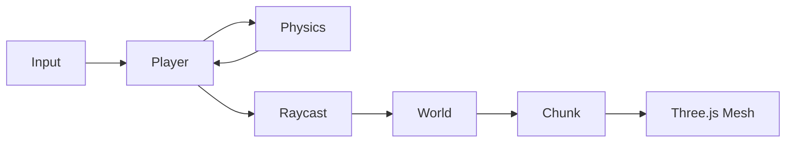

# Minecraft-Like コアメカニクス — 設計ドキュメント

**作成日:** 2026-06-19  
**ステータス:** 承認済み

---

## 概要

ブラウザで動作するMinecraftライクなゲームのコアメカニクスプロトタイプ。
ブロックの配置・破壊、手続き生成によるワールド、一人称視点での移動を実装する。
サバイバル要素・マルチプレイは対象外。

---

## 技術スタック

| 役割 | ライブラリ |
|------|-----------|
| レンダリング | Three.js |
| 物理エンジン | @dimforge/rapier3d-compat（WebAssembly） |
| ビルドツール | Vite |
| 言語 | TypeScript |
| 地形生成 | simplex-noise |
| テスト | Vitest |

---

## アーキテクチャ

### モジュール構成

```
src/
├── main.ts              # エントリポイント・ゲームループ
├── world/
│   ├── World.ts         # チャンク管理・ブロックデータ
│   ├── Chunk.ts         # 16×64×16 のブロック配列 + メッシュ生成
│   └── worldgen.ts      # Perlinノイズによる地形生成
├── blocks/
│   └── BlockRegistry.ts # ブロック種別の定義（ID・テクスチャ・硬度）
├── player/
│   ├── Player.ts        # 入力・カメラ・Rapierキャラクターコントローラー
│   └── Raycast.ts       # ブロック選択・配置・破壊の当たり判定（DDA）
├── renderer/
│   └── Renderer.ts      # Three.js シーン・ライト・ループ管理
└── physics/
    └── Physics.ts       # Rapierワールド・コリジョン同期
```

### データフロー



---

## ワールド・チャンク設計

### チャンク仕様

| パラメータ | 値 |
|-----------|-----|
| チャンクサイズ | 16 × 64 × 16（X/Z方向16、高さ64） |
| レンダー距離 | プレイヤー中心 ±3 チャンク（7×7 = 49チャンク） |
| ブロックデータ | `Uint8Array`（1バイト/ブロック、0=空気） |

### 地形生成

simplex-noise による高さマップ生成。

```
高さ = 32 + noise(x, z) × 16
高さより上       → 空気（ID: 0）
高さ（上面）      → 草ブロック（ID: 4）
高さ-1〜高さ-4   → 土ブロック（ID: 3）
それ以下         → 石ブロック（ID: 2）
Y=0              → 岩盤（ID: 1）
```

### ブロック種別

| ID | 名前 | 用途 |
|----|------|------|
| 0 | 空気 | 空 |
| 1 | 岩盤 | 最下層（破壊不可） |
| 2 | 石 | 地下 |
| 3 | 土 | 草の下 |
| 4 | 草 | 地表上面 |
| 5 | 木材 | 配置可能な素材 |

### チャンクのライフサイクル

1. プレイヤーが移動 → レンダー距離内に未生成チャンクが入る
2. `World` がチャンクを生成しブロックデータを構築（1フレーム1チャンクずつ分散）
3. `Chunk` がブロックデータから**見える面のみ**を抽出してメッシュ化（フェイスカリング）
4. レンダー距離外に出たチャンクは Three.js から dispose して破棄

---

## プレイヤー・物理設計

### Rapier キャラクターコントローラー

`KinematicCharacterController` を使用。

| 設定 | 値 |
|------|----|
| コリジョン形状 | カプセル（半径 0.3、高さ 1.8） |
| 重力 | 9.8 m/s² 相当 |
| 段差乗り越え | 0.5 ブロックまで |
| スロープ制限 | 45°まで歩行可 |

### 入力・操作

| 操作 | 処理 |
|------|------|
| WASD | 水平移動（カメラ向き基準） |
| Space | ジャンプ |
| マウス移動 | カメラ回転（Pointer Lock API） |
| 左クリック | ブロック破壊 |
| 右クリック | ブロック配置 |
| 数字キー 1〜5 | 手持ちブロック切り替え |

### レイキャスト（DDA）

- DDA（Digital Differential Analyzer）アルゴリズムで実装
- 到達距離: 5ブロック固定
- 当たった面の方向から配置位置を算出
- 照準: 画面中央の十字線（HTML overlay）

### チャンクコリジョン同期

ブロックを配置・破壊したとき、該当チャンクの Rapier コリジョン形状を再構築。
隣接チャンク境界面への影響がある場合は隣チャンクも再構築する。

---

## レンダリング・UI設計

### Three.js レンダリング

| 項目 | 方針 |
|------|------|
| メッシュ戦略 | チャンクごとに1つの `BufferGeometry`（頂点結合） |
| テクスチャ | 1枚のテクスチャアトラス（256×256px） |
| マテリアル | `MeshLambertMaterial` |
| 環境光 | `AmbientLight` + 太陽方向の `DirectionalLight` |
| フォグ | `THREE.Fog`（レンダー距離の端をフェードアウト） |
| アンチエイリアス | なし（ドット感を維持） |

### UI（HTML overlay）

- **十字線（クロスヘア）** — `<div>` で画面中央に固定
- **ホットバー** — 選択中のブロック種別を表示
- **デバッグ情報** — 座標・FPS・チャンク数（開発中のみ）

Three.js シーンに UI を混在させず、HTML/CSS overlay に徹する。

### パフォーマンス上の注意

- チャンク生成は1フレーム1チャンクずつ分散してフリーズを防ぐ
- `World` モジュールは外部依存を持たず、将来の Web Worker 移行に対応できる設計とする

---

## スコープ外（このプロトタイプでは実装しない）

- サバイバル要素（ライフ・空腹・モブ）
- マルチプレイヤー
- クラフトシステム
- 昼夜サイクル
- セーブ・ロード
