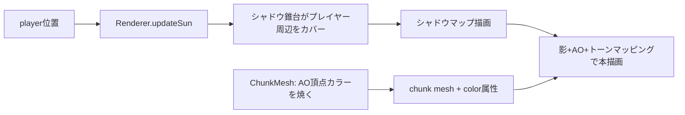

# 影mod（動的影 + 頂点AO + トーンマッピング）— 設計ドキュメント

**作成日:** 2026-06-20
**ステータス:** 承認済み

---

## 概要

Minecraftの「影mod（シェーダーパック）」風のビジュアル強化を、本プロトタイプに導入する。
スコープは **動的な太陽の影**・**頂点AO（スムースライティング）**・**ACESトーンマッピング** の3点。
ブルーム/ゴッドレイ/水反射などのポスト処理、昼夜サイクルはスコープ外。

---

## 技術スタック（既存）

- Three.js 0.170（WebGLRenderer）
- TypeScript strict / Vite / Vitest
- 既存レンダリング: `MeshLambertMaterial` + テクスチャアトラス、`AmbientLight` + 固定 `DirectionalLight`、`THREE.Fog`

---

## スコープ

| 機能 | 採用 | 備考 |
|------|------|------|
| 動的な太陽の影（シャドウマップ） | ✅ | 影modの核心 |
| 頂点AO（スムースライティング） | ✅ | ブロック隅の陰影 |
| ACESトーンマッピング | ✅ | 全体の質感 |
| ブルーム/ゴッドレイ/水反射/ボリュメトリック | ❌ | ポスト処理は過剰 |
| 昼夜サイクル | ❌ | 太陽は固定角度 |

---

## コンポーネント設計

### 1. constants.ts（追加定数）

```
SUN_DIRECTION: 正規化された固定の太陽方向ベクトル（見栄えする斜め上方向、例 (-0.5, -1, -0.3) を正規化）
SHADOW_MAP_SIZE: シャドウマップ解像度（2048）
SHADOW_CAMERA_EXTENT: シャドウ正射影カメラの半幅。±RENDER_DISTANCE チャンクをカバー（= RENDER_DISTANCE * CHUNK_WIDTH 前後）
SHADOW_BIAS: シャドウアクネ防止バイアス（-0.0005 程度）
AO_LEVELS: 隣接ソリッド数(0..3) → 明度倍率の対応表（例 [1.0, 0.75, 0.55, 0.4]）
```

これらは「変更可能な定数」として定義する。値は実装時にブラウザで視覚調整してよい（範囲は上記目安）。

### 2. ChunkMesh.ts（頂点AO）

各面の各頂点（隅）について、その隅に隣接する3ブロックの充填数からAOレベル(0..3)を求め、
明度倍率を **頂点カラー属性 `color`（RGB同値のグレースケール）** として焼く。

- AO対象の3ブロック：面法線方向に1つ進んだ平面上で、その頂点隅に接する「2つの辺ブロック」と「1つの角ブロック」。
- 古典的Minecraft AO規則：
  - `side1` と `side2`（辺2つ）が両方ソリッドなら最大遮蔽（レベル3）。
  - それ以外は `side1 + side2 + corner` のソリッド数(0..3)をレベルとする。
- 各レベルを `AO_LEVELS` で明度倍率に変換し、`color` 属性に書く（r=g=b=倍率）。
- `buildChunkGeometry` は隣接ブロック判定に既存の `getNeighborBlock` コールバックと `chunk.getBlock` を流用する。
- **巻き順・UV・フェイスカリング・positions は不変**。`geometry.setAttribute('color', ...)` を追加するのみ。

純粋関数として `computeVertexAO(side1: boolean, side2: boolean, corner: boolean): number`（0..3を返す）を切り出し、単体テスト対象とする。

### 3. Renderer.ts（影・トーンマッピング・太陽追従）

- `renderer.shadowMap.enabled = true`、`renderer.shadowMap.type = THREE.PCFSoftShadowMap`
- `renderer.toneMapping = THREE.ACESFilmicToneMapping`、`renderer.toneMappingExposure = 1.0`
- 太陽 `DirectionalLight`:
  - `castShadow = true`
  - `shadow.mapSize.set(SHADOW_MAP_SIZE, SHADOW_MAP_SIZE)`
  - `shadow.camera`（OrthographicCamera）の `left/right/top/bottom = ±SHADOW_CAMERA_EXTENT`、`near/far` は錐台がプレイヤー周辺を縦に貫くよう設定
  - `shadow.bias = SHADOW_BIAS`
  - ライトと `light.target` をシーンに追加
- マテリアルに `vertexColors: true` を設定（AO頂点カラーを反映）。Lambert は据え置き。
- ライティングバランス調整：影が読めるよう ambient を下げ sun を上げる（例 ambient 0.6→0.4、sun 0.8→1.0。最終値は視覚調整）。
- チャンクメッシュ追加時に `mesh.castShadow = true; mesh.receiveShadow = true`。
- **太陽のプレイヤー追従**：新メソッド `updateSun(px: number, py: number, pz: number): void`。
  - `SUN_DIRECTION` を基準に、ライト位置をプレイヤーから太陽方向の逆に一定距離オフセットし、`target` をプレイヤー位置に向ける。
  - これによりシャドウ錐台（限られた解像度）が常にプレイヤー周辺をカバーする。

### 4. main.ts（ループ結線）

レンダーループ内で `renderer.updateSun(player.position.x, player.position.y, player.position.z)` を毎フレーム呼ぶ（`renderer.start` のコールバック内、`world.update` の前後どちらでもよい）。

---

## データフロー



AOはジオメトリ生成時（チャンクごと静的）に確定。影と太陽追従は毎フレーム更新。

---

## テスト

- **AOロジック（`computeVertexAO`）**：純関数として単体テスト。
  - 辺2つソリッド → 3（最大遮蔽）
  - 遮蔽なし → 0
  - 各組み合わせ（side1/side2/corner）で期待レベルを検証。
- **`buildChunkGeometry` の color 属性**：単一ブロック等で `color` 属性が存在し、露出面の頂点が期待レベルの明度を持つことを検証（既存の法線/UVテストは維持）。
- 影・トーンマッピング・太陽追従・ライティングバランスは視覚要素 → 実装時にブラウザでスクリーンショット検証（dev server は検証後に終了、スクショは削除）。

---

## エラー処理・整合性

- AO計算はチャンク境界で `getNeighborBlock`（未生成チャンクは AIR 扱い）を流用。境界の一時的なAO不整合は許容（チャンク再構築時に解消）。
- シャドウ錐台外のブロックは影を落とさない（描画範囲端のみ。フォグで目立たない）。

---

## スコープ外（このプロトタイプでは実装しない）

- ブルーム・ゴッドレイ・SSAO（スクリーン空間AO）・水反射・ボリュメトリックライト
- 昼夜サイクル・太陽の移動
- 複数光源・点光源の影
